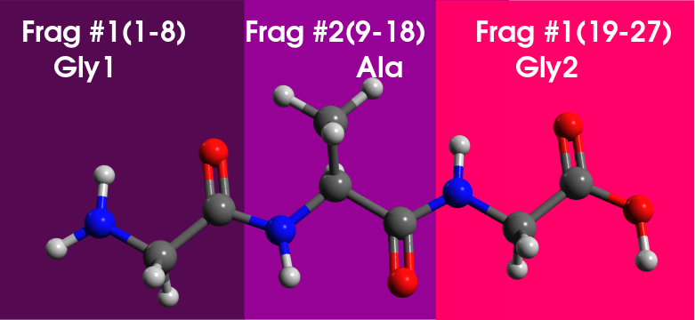
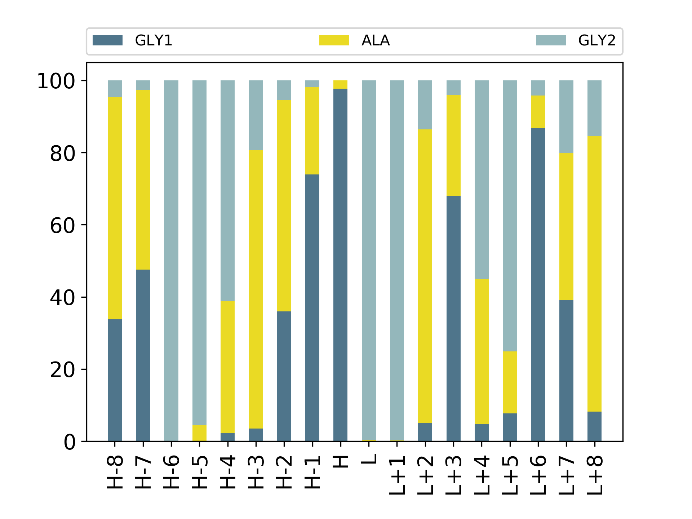

# Gaussian Post-Process


Several post-processing for Gaussian calculation


## Fragment orbital analysis

This is a Orbital composition analysis using Gaussian and Multiwfn
you can download Multiwfn from
http://sobereva.com/multiwfn/download.html

We can start with [Linux binary version](http://sobereva.com/multiwfn/misc/Multiwfn_3.7_dev_bin_Linux.zip) and after download unzip downloaded file in a directory.
cd to the MULTIWFN directory and only change mode the Multiwfn file  
    `chmod +x Multiwfn`  
and add path of binary file to end of your *~/.bashrc*   

`export PATH=$PATH:/PATH/OF/Multiwfn_3.7_dev_bin_Linux`  
In this step you need to source your bashrc   
`source ~/.bashrc`


test your Multiwfn by following command  
             `Multiwfn Test.Fchk`  
             If you have something like this in yout terminal then it is OK  


```shell
************ Main function menu ************
0 Show molecular structure and view orbitals
1 Output all properties at a point
2 Topology analysis
3 Output and plot specific property in a line
4 Output and plot specific property in a plane
5 Output and plot specific property within a spatial region (calc. grid data)
6 Check & modify wavefunction
7 Population analysis and atomic charges
8 Orbital composition analysis
9 Bond order analysis
10 Plot total DOS, partial DOS, OPDOS, local DOS and photoelectron spectrum
```

###Python script for orbital decomposition over the fragments of a molecule

Here, we want to project all molecular orbitals over the given molecular fragment to analyze contribution of each molecular group in the frontier orbitals,  
To do this first of all we can define fragments in a text file

### Example

We made a poly-peptide (Gly-Ala-Gly)

and as is shown in figure there are 3 distict fragment in this molecule.

Now we want to calculate contribution of each group in the frontier orbitals,


The script  [mo-g09.py](./mo-g09.py) reads <span style="color:red">Test.FChk </span> and [groups.txt](groups.txt) and number of frontier orbitals, and plots a stackbar graph with contribution of each group in all orbitals near the HOMO-LUMO  
then we need to make a text file to declare all fragments based on the number of atoms which you can see in *Avogadro*




## UV-Vis Spectrum for several output
